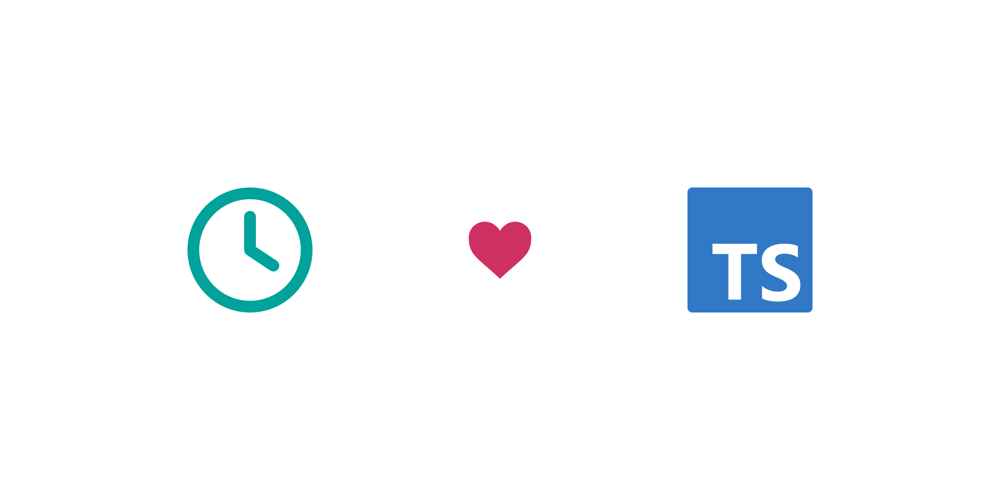

# @aaronellington/time-ts



A time library for TypeScript. (Heavily inspired by the [Go time package](https://pkg.go.dev/time).)

Documentation: [typedoc](https://aaronellington.github.io/time-ts/)

npm package: [@aaronellington/time-ts](https://www.npmjs.com/package/@aaronellington/time-ts)

## Installation

```shell
npm i @aaronellington/time-ts
```
